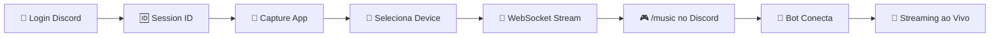

# Nakama 🎧 - Sua Voz no Discord, Simplificada

**Nakama** é um sistema completo que permite capturar o áudio local do seu computador e transmiti-lo diretamente para canais de voz do Discord através de um bot dedicado. Desenvolvido com uma arquitetura moderna e interface intuitiva.

## 🚀 Estado Atual da Implementação

O projeto Nakama está **funcionalmente completo** com todas as funcionalidades principais implementadas:

### ✅ **Módulos Implementados**

*   **[Frontend](./frontend/)** - Interface web moderna com Astro + React + TailwindCSS
*   **[Backend API](./backend/)** - API robusta com Node.js + Fastify + WebSocket
*   **[Bot Discord](./discord-bot/)** - Bot completo com discord.js v14 + @discordjs/voice
*   **[App de Captura](./capture-app/)** - Aplicativo Electron com captura de áudio real
*   **[Banco de Dados](./database/schema.sql)** - Schema SQL para PostgreSQL/SQLite

### 🎯 **Funcionalidades Implementadas**

*   ✅ **Login via Discord OAuth2** - Sistema completo de autenticação
*   ✅ **Dashboard Inteligente** - Interface responsiva com monitoramento em tempo real
*   ✅ **Seleção de Dispositivos de Áudio** - Interface web + captura real no PC
*   ✅ **Transmissão de Áudio em Tempo Real** - WebSocket + PCM/Opus streaming
*   ✅ **Comando `/music`** - Bot Discord com validação e sincronização
*   ✅ **Segurança Completa** - JWT, validação de sessões, autenticação API
*   ✅ **Monitoramento em Tempo Real** - Status de conexões e métricas

## 🛠️ Stack Tecnológica Implementada

*   **Frontend**: Astro 4.0, React 18, TailwindCSS 3.3
*   **Backend**: Node.js 18+, Fastify 4.20, WebSocket
*   **Bot Discord**: discord.js v14, @discordjs/voice
*   **App de Captura**: Electron 28.0, naudiodon (node-portaudio)
*   **Banco de Dados**: PostgreSQL (produção) / SQLite (desenvolvimento)
*   **Autenticação**: Discord OAuth2, JWT com cookies HttpOnly

## 📖 Como Funciona (Fluxo Implementado)



1. **Usuário faz login** no dashboard web via Discord OAuth2
2. **Sistema gera Session ID** única e exibe no dashboard
3. **Usuário abre Capture App** e configura com Session ID  
4. **Seleciona dispositivo de áudio** via interface web inteligente
5. **App inicia captura** de áudio real usando naudiodon
6. **No Discord**: comando `/music <session_id>` para conectar bot
7. **Bot valida sessão** e conecta ao canal de voz
8. **Streaming em tempo real** do PC para Discord com baixa latência

## 🚀 Instalação e Configuração

### **Pré-requisitos**
- Node.js 18+ 
- Git
- Discord Application (Bot + OAuth2)

### **1. Configuração Inicial**
```bash
git clone <repository-url>
cd nakama-discord-bot
```

### **2. Backend API**
```bash
cd backend
npm install
cp .env.example .env  # Configure suas variáveis
npm run dev
```

### **3. Frontend Web**
```bash
cd frontend
npm install
npm run dev
```

### **4. Discord Bot**
```bash
cd discord-bot
npm install
cp .env.example .env  # Configure bot token
npm run dev
```

### **5. Capture App**
```bash
cd capture-app
npm run setup  # Instala naudiodon
npm start
```

### **6. Variáveis de Ambiente**

**Backend (`.env`)**:
```env
DISCORD_CLIENT_ID=your_discord_client_id
DISCORD_CLIENT_SECRET=your_discord_client_secret
JWT_SECRET=your_super_secret_jwt_key
BOT_API_KEY=your_bot_api_key
DISCORD_REDIRECT_URI=http://localhost:3000/api/auth/callback
FRONTEND_CALLBACK_URL=http://localhost:4321/auth/callback
```

**Discord Bot (`.env`)**:
```env
DISCORD_BOT_TOKEN=your_bot_token
DISCORD_CLIENT_ID=your_discord_client_id
NAKAMA_BACKEND_URL=http://localhost:3000/api
NAKAMA_BOT_API_KEY=your_bot_api_key
```

## 🎵 Como Usar

### **1. Fazer Login**
1. Acesse `http://localhost:4321`
2. Clique em "Entrar com Discord"
3. Autorize a aplicação
4. Copie seu **Session ID** do dashboard

### **2. Configurar Captura**
1. Abra o **Nakama Capture App**
2. Cole seu **Session ID**
3. Configure token JWT (se necessário)
4. Selecione dispositivo de áudio na interface web

### **3. Usar no Discord**
1. Entre em um canal de voz
2. Execute: `/music <session_id>`
3. Bot conecta e reproduz seu áudio

## 📊 Funcionalidades Avançadas

### **Dashboard Inteligente**
- Monitoramento em tempo real das conexões
- Seleção de dispositivos de áudio via web
- Status de sincronização com Discord Bot
- Métricas de transmissão (bitrate, latência)

### **Capture App Robusto**
- Captura de áudio real usando naudiodon
- Fallback para simulação se biblioteca não disponível
- Interface gráfica moderna
- Sistema tray para controle em background
- Teste de dispositivos de áudio

### **Integração Completa**
- Sincronização automática entre componentes
- Validação de sessões e segurança
- Tratamento de erros robusto
- Logs detalhados para debugging

## 🔧 Desenvolvimento

### **Estrutura do Projeto**
```
nakama-discord-bot/
├── frontend/          # Interface web (Astro + React)
├── backend/           # API + WebSocket (Fastify)
├── discord-bot/       # Bot Discord (discord.js)
├── capture-app/       # App de captura (Electron)
├── database/          # Schema SQL
└── docs/             # Documentação
```

### **Scripts Úteis**
```bash
# Instalar todas as dependências
npm run install:all

# Iniciar todos os serviços
npm run dev:all

# Build para produção
npm run build:all

# Testes
npm run test:all
```

## 🚀 Deploy em Produção

### **Requisitos do Servidor**
- Linux (Debian/Ubuntu preferido)
- Node.js 18+
- PostgreSQL 14+
- Nginx/Caddy (proxy reverso)
- SSL/TLS certificates

### **Docker (Recomendado)**
```bash
docker-compose up -d
```

### **Deploy Manual**
1. Configure banco PostgreSQL
2. Deploy backend com PM2
3. Build e deploy frontend estático
4. Configure bot como serviço
5. Setup proxy reverso + SSL

## 🔐 Segurança

- **Autenticação Discord OAuth2** com validação rigorosa
- **JWT tokens** com cookies HttpOnly
- **API Key** para comunicação bot-backend
- **Validação de sessões** com TTL
- **Rate limiting** em todas as rotas
- **Sanitização** de inputs

## 📝 Próximas Melhorias

- [ ] **Banco de dados real** (migração do mock para PostgreSQL)
- [ ] **Sistema de logs** centralizado
- [ ] **Métricas avançadas** (Prometheus/Grafana)
- [ ] **Testes automatizados** (Jest/Vitest)
- [ ] **Deploy automatizado** (CI/CD)
- [ ] **Documentação API** (Swagger)
- [ ] **Multi-idioma** (i18n)

## 🤝 Contribuindo

1. Fork o projeto
2. Crie uma branch para sua feature
3. Commit suas mudanças
4. Push para a branch
5. Abra um Pull Request

## 📄 Licença

Este projeto está sob a licença MIT. Veja o arquivo [LICENSE](LICENSE) para detalhes.

## 🆘 Suporte

- **Documentação**: [docs/](./docs/)
- **Issues**: [GitHub Issues](https://github.com/your-repo/issues)
- **Discord**: [Servidor de Suporte](https://discord.gg/your-server)

---

*Desenvolvido com ❤️ usando tecnologias modernas para proporcionar a melhor experiência de streaming de áudio para Discord.*
